## Задача 1

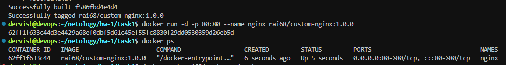
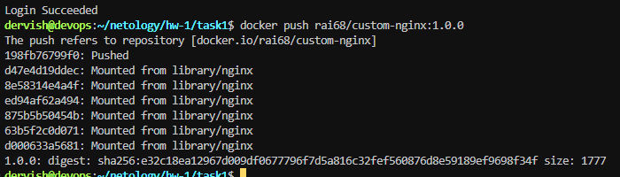
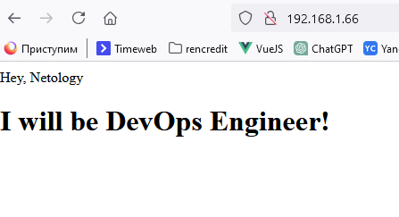
[Ссылка на docker hub](https://hub.docker.com/repository/docker/rai68/custom-nginx/general)

## Задача 2

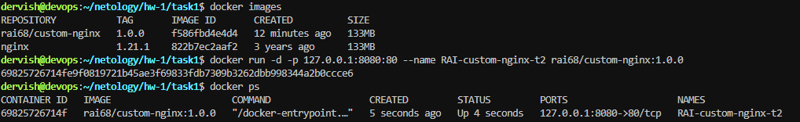
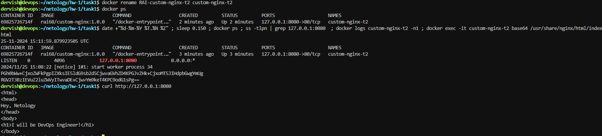

## Задача 3
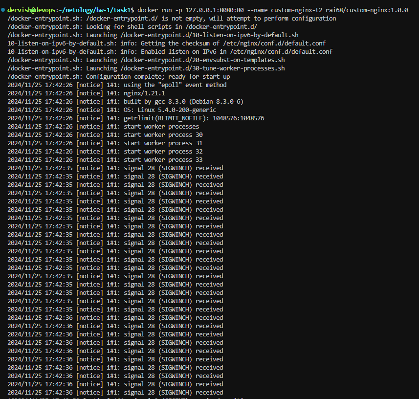
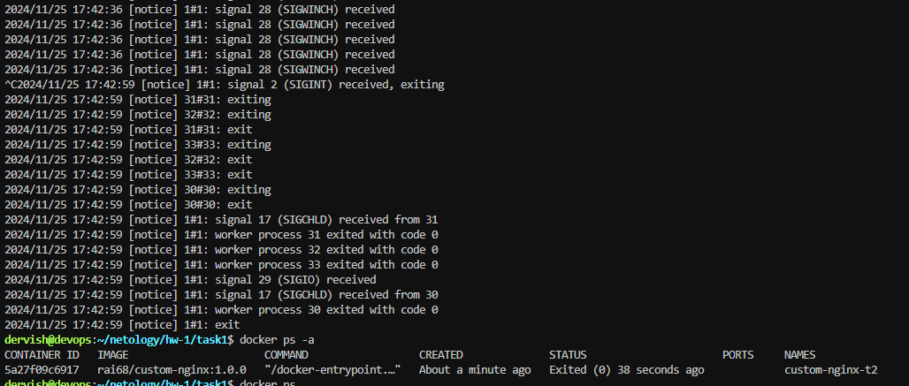
При запуске docker контейнера основной процесс nginx имеет PID 1. Контейнер будет работать до тех пор, пока запущен этот процесс. Нажатие клавиш Ctrl-C отправляет сигнал SIGINT текущему (основному) процессу, он перестает работать, а вместе с ним происходит и остановка контейнера

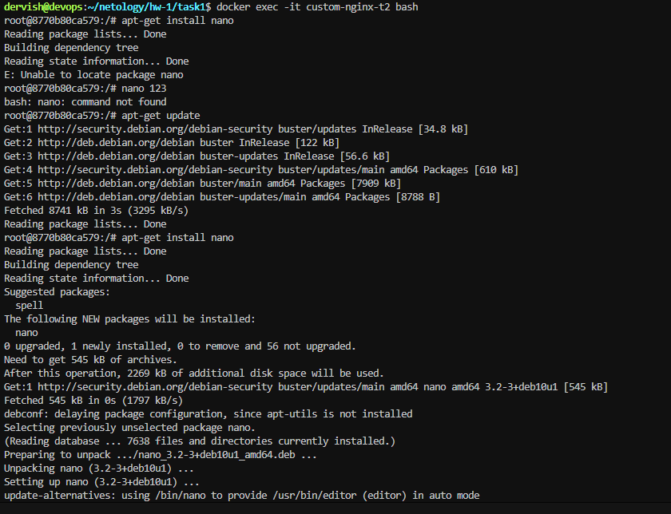
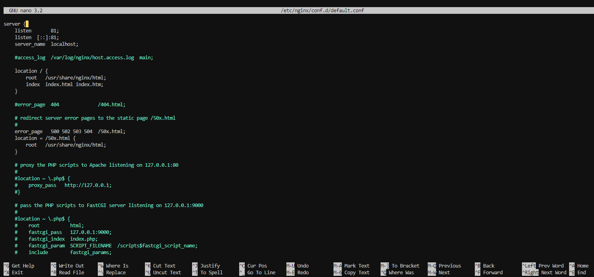
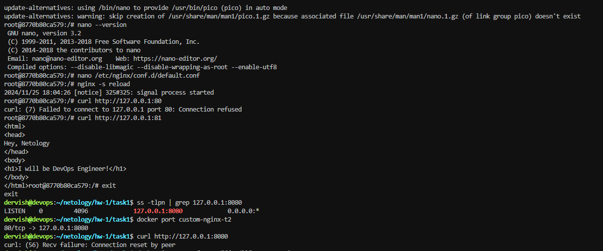
При запуске контейнера был сделан мапинг порта 8080 хостовой машины на порт 80 контейнера, затем в конфигурации nginx был изменен прослушиваемый порт с 80 на 81. Т.е. nginx стал работать на 81 порту, который не привязан к порту 8080 хостовой машины, а значит не доступен при обращении с нее к контейнеру.

Попробуем исправить проблемы с доступностью nginx

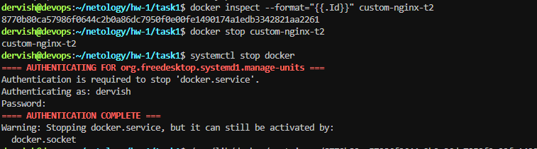
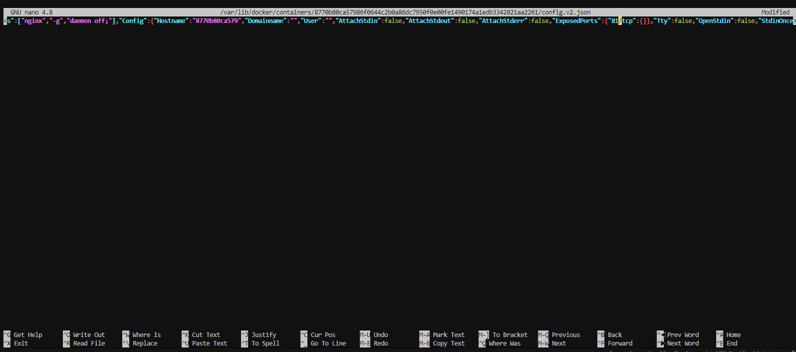
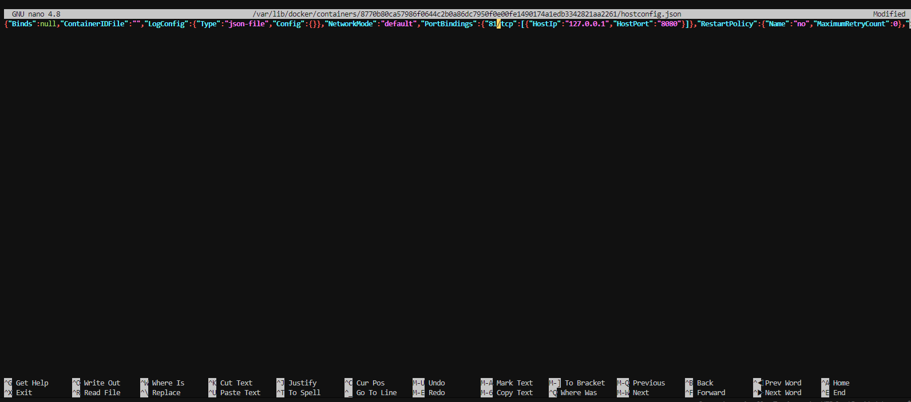
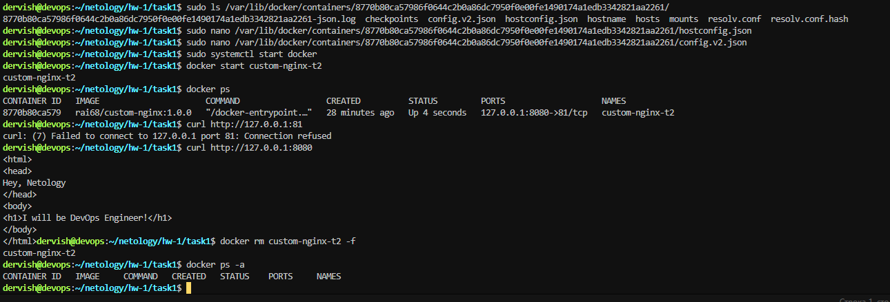
Теперь все снова работает!