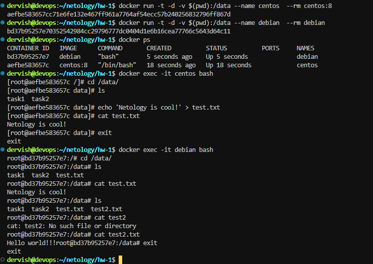
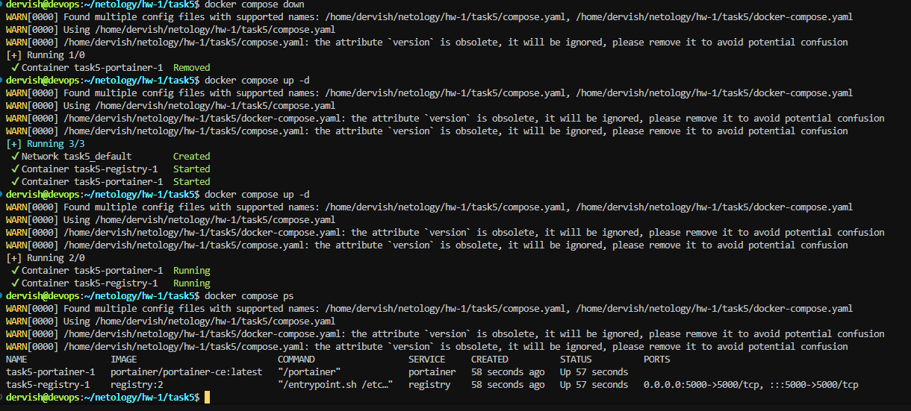
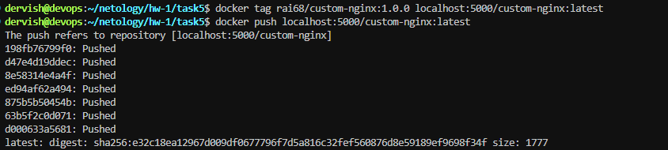
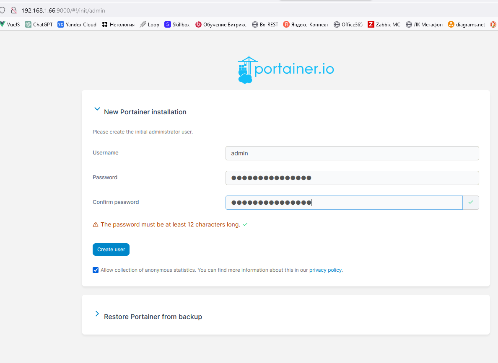
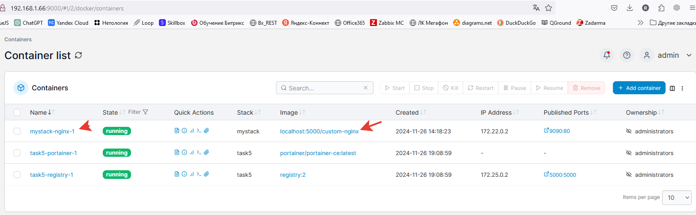
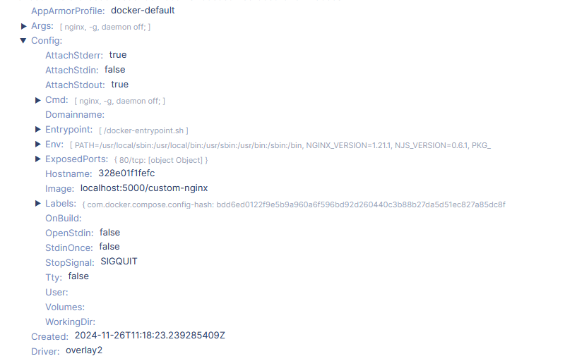
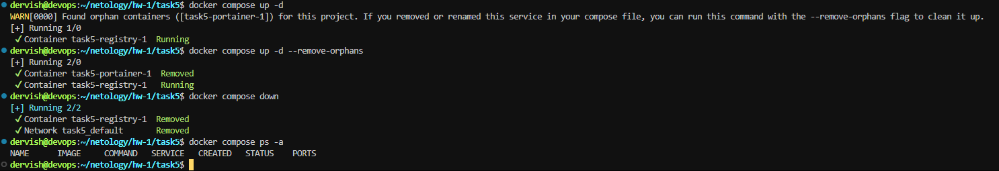

## Задача 1

[Ссылка на docker hub](https://hub.docker.com/repository/docker/rai68/custom-nginx/general)

## Задача 2

## Задача 3

При запуске docker контейнера основной процесс nginx имеет PID 1. Контейнер будет работать до тех пор, пока запущен этот процесс. Нажатие клавиш Ctrl-C отправляет сигнал SIGINT текущему (основному) процессу, он перестает работать, а вместе с ним происходит и остановка контейнера

При запуске контейнера был сделан мапинг порта 8080 хостовой машины на порт 80 контейнера, затем в конфигурации nginx был изменен прослушиваемый порт с 80 на 81. Т.е. nginx стал работать на 81 порту, который не привязан к порту 8080 хостовой машины, а значит не доступен при обращении с нее к контейнеру.

Попробуем исправить проблемы с маппингом портов контейнера

Теперь все снова работает!

## Задача 4

## Задача 5

Файлом по умолчанию для файла Compose является compose.yaml (предпочтительно) или compose.yml в рабочем каталоге. Compose также поддерживает docker-compose.yaml и docker-compose.yml для обратной совместимости с более ранними версиями. Если существуют оба файла, Compose предпочитает канонический compose.yaml. Поэтому и был запущен только один сервис из файла compose.yaml

После включения в файл compose.yaml через include содержимого файла docker-compose.yaml поднялись оба сервиса

Пушим образ в локальный registry делаем первоначальные настройки и деплоим образ из компоуза через web editor

Удаляем compose.yaml
Выходит предупреждение о том, что имеются контейнеры, для которых нет описания в текущем компоузе. Для устранения ошибки нужно запустить команду docker-compose up -d --remove-orphans

